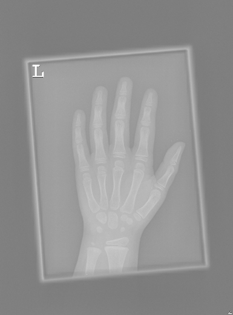

# Pediatric Bone Age Assessment

[Run on Neu.ro](https://apps.neu.ro/ml-recipes/bone-age)

[Explore on GitHub](https://github.com/neuromation/ml-recipe-bone-age)

In this project, we introduce the problem of pediatric bone age assessment. During an organism’s development, the bones of the skeleton change in size and shape. Difference between a child’s assigned bone age and chronological age might indicate a growth problem. Clinicians use bone age assessment in order to estimate the maturity of a child’s skeletal system.

Bone age assessment usually starts with taking a single X-ray image of the left hand from wrist to fingertips. Traditionally, bones in the radiograph are compared with images in a standardized atlas of bone development. This recipe represents a core approach described in _"Paediatric Bone Age Assessment Using Deep Convolutional Neural Networks" by V. Iglovikov, A. Rakhlin, A. Kalinin and A. Shvets_, [link 1](https://link.springer.com/chapter/10.1007%2F978-3-030-00889-5_34), [2](https://www.biorxiv.org/content/biorxiv/early/2018/06/20/234120.full.pdf).

We validate the performance of the method by using data from the 2017 Pediatric Bone Age Challenge organized by the Radiological Society of North America \(RSNA\). The data set has been contributed by 3 medical centers at Stanford University, the University of Colorado and the University of California - Los Angeles. Originally, the dataset was shared by the AIMI Center of Stanford University and now can be freely accessed at [Kaggle platform](https://kaggle.com/kmader/rsna-bone-age). For the sake of simplicity, we skip intense preprocessing steps as described in the original work and provide radiographs with already removed background and uniformly registered hand imagess.




### Technologies

* `Catalyst` as pipeline runner for deep learning tasks. This new and rapidly developing [library](https://github.com/catalyst-team/catalyst) can significantly reduce the amount of boilerplate code. If you are familiar with the TensorFlow ecosystem, you can think of Catalyst as Keras for PyTorch. This framework is integrated with logging systems such as the well-known [TensorBoard](https://www.tensorflow.org/tensorboard) and the new [Weights & biases](https://www.wandb.com/).

## Quick Start

#### 0. Sign up

#### 1. Install CLI and log in

```text
pip install -U neuro-cli neuro-extras neuro-flow
neuro login
```

#### 2. Run the recipe

```text
git clone git@github.com:neuromation/ml-recipe-bone-age.git
cd ml-recipe-bone-age
make setup
make jupyter
```

#### 3. Train the model

Download the dataset from within the demo notebook, then run:

```text
make training
```

