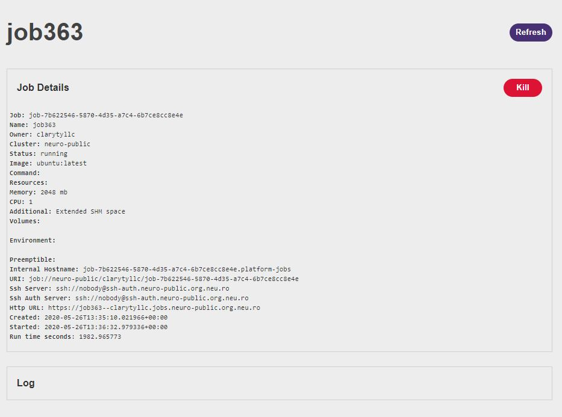
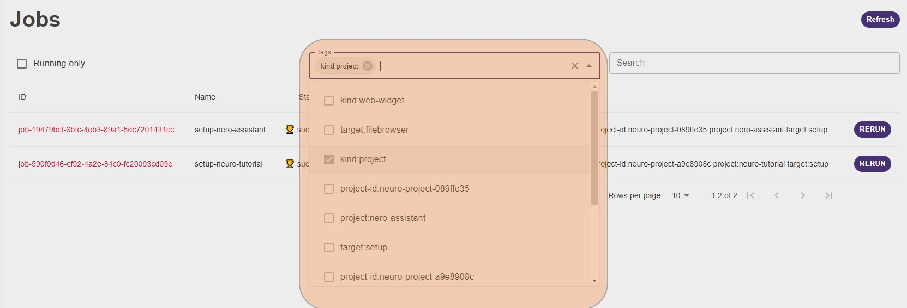
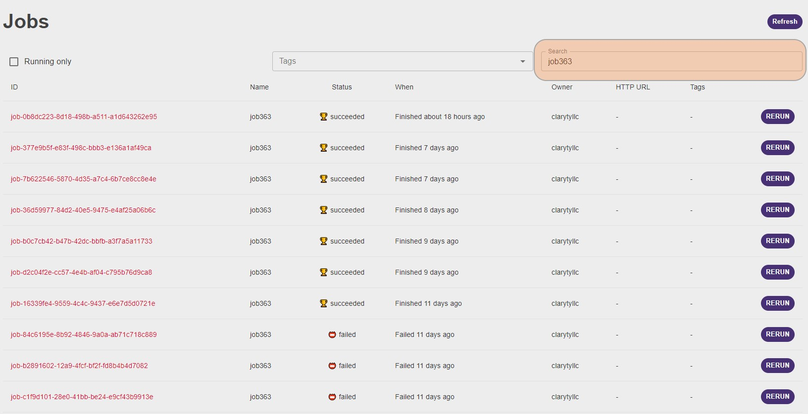

# Задания

Задание - это простейший исполняемый элемент. Вы можете запустить задание в заданном рабочем окружении с заданным набором ресурсов и с заданным объемом дискового пространства для хранения данных. Задания являются строительными блоками Вашего проекта и должны быть тщательно спланированы для оптимального использования ресурсов.

Прежде чем запустить задание, необходимо определить:

* Образ Docker, используемый для запуска задания. Обратите внимание, что задание завершается, если запуск контейнера Docker завершается сбоем, исключая случаи, когда для задания используется специальная политика перезапуска.
* Предустановку (далее пресет) - комбинацию ресурсов CPU, GPU и памяти для использования в задании.

В сложных проектах Вы можете иметь несколько заданий, запущенных с разными пресет, которые лучше всего подходят для работы конкретного задания.

## Что такое пресет?

Neu.ro позволяет запускать задание в рабочем окружении с заданным пресет с несколькими томами для хранения данных. Здесь под пресет понимается комбинация ресурсов CPU, GPU и памяти.

Вы должны определить и установить количество ресурсов CPU, GPU и памяти, которые Вы хотите использовать для работы. По умолчанию, если пресет не упоминается, используется пресет cpu-small. Данные ограничения гарантируют лучшее использование ресурсов в вычислительном кластере.

Например, в данной команде мы используем пресет cpu-small, поскольку задание не требует большой вычислительной мощности.

**Пример команды:**

```text
(base) C:\Projects>neuro run --preset cpu-small --name test ubuntu echo Hello, World! 
Job ID: job-43ca33a4-5a4c-4eee-9ac1-67deb7c66e14 Status: pending
Name: test
Http URL: https://test--clarytyllc.jobs.neuro-public.org.neu.ro
Shortcuts:
  neuro status test # check job status
  neuro logs test # monitor job stdout
  neuro top test # display real-time job telemetry
  neuro exec test bash # execute bash shell to the job
  neuro kill test # kill job
Status: pending Creating
Status: pending Scheduling
Status: running
Terminal is attached to the remote job, so you receive the job`s output.
Use Ctrl-C to detach (it will NOT terminate the job), or restart thejob with `--detach` option.
Hello, World!
```

Neu.ro имеет набор пресетов, которые подходят для выполнения различных видов рабочих нагрузок. Некоторые задания могут также потребовать ресурсов GPU. Вы можете просмотреть список доступных пресетов, используя команду `neuro config show`.

```text
(base) C:\Projects>neuro config show
User Configuration:
  User Name: clarytyllc
  Current Cluster: neuro-public
  API URL: https://staging.neu.ro/api/v1
  Docker Registry URL: https://registry.neuro-public.org.neu.ro
  Resource Presets:
    Name         CPU    Memory    Preemptible    GPU
    cpu-small    1.0    2.0G          No
    cpu-large    7.0    28.0G         No
    gpu-small    3.0    57.0G         No         1 x nvidia-tesla-k80
    gpu-small-p  3.0    57.0G         Yes        1 x nvidia-tesla-k80
    gpu-large    7.0    57.0G         No         1 x nvidia-tesla-v100
    gpu-large-p  7.0    57.0G         Yes        1 x nvidia-tesla-v100
```

Команда выводит список доступных пресетов и их конфигураций. Например, пресет cpu-small включает в себя 1 CPU, 2 ГБ памяти, без GPU. С другой стороны, gpu-large включает 7 CPU, 57 ГБ памяти и графический процессор nvidia-tesla-v100.

## Как запустить задание?

Чтобы запустить задание в CLI, Вы можете использовать команду `neuro run`. Эта команда принимает множество различных аргументов, большинство из них описаны в этом и следующих разделах.

Каждое задание имеет уникальный идентификатор ID. Для Вашего удобства Вы можете дать имя заданию. Может быть только одно именованное задание со статусами PENDING или RUNNING.

Каждое задание имеет доступ к своему временному дисковому пространству (которое, по сути, является частью SSD на физической машине, на которой выполняется это задание). Данный тип хранилища быстрый, но не постоянный: как только вы завершаете задание, данные теряются.

Чтобы сохранить данные, Вы можете подключить к заданию тома для хранения данных. Этот тип хранения немного медленнее и имеет некоторые ограничения. Например, обучение модели на данных из примонтированной папки обычно выполняется на 10-20% медленнее. Кроме того, случайные операции записи \(например, разархивирование\) очень медленные и крайне не рекомендуются.

**Пример команды:**

1. **Выполнить короткое задание без монтажа дискового пространства:**

```text
(base) C:\Projects>neuro run --preset cpu-small --name job230 ubuntu echo Hello, World!
Job ID: job-43ca33a4-5a4c-4eee-9ac1-67deb7c66e14
Status: pending
Name: job230
Http URL: https://job230--clarytyllc.jobs.neuro-public.org.neu.ro
Shortcuts:
  neuro status job230 # check job status
  neuro logs job230 # monitor job stdout
  neuro top job230 # display real-time job telemetry
  neuro exec job230 bash # execute bash shell to the job
  neuro kill job230 # kill job
Status: pending Creating
Status: pending Scheduling
Status: running
Terminal is attached to the remote job, so you receive the job`s output.Use Ctrl-C to detach (it will NOT terminate the job), or restart thejob with `--detach` option.
Hello, World!
```

1. **Выполнить длительное задание с монтажом томов для хранения данных**

```text
(base) C:\Projects>neuro run --name job303 --volume storage:nero-assistant/ModelCode/:/code:rw --preset cpu-small neuromation/base python /code/train.py
Job ID: job-43ca33a4-5a4c-4eee-9ac1-67deb7c66e14
Status: pending
Name: job303
Http URL: https://job303--clarytyllc.jobs.neuro-public.org.neu.ro
Shortcuts:
  neuro status job303 # check job status
  neuro logs job303 # monitor job stdout
  neuro top job303 # display real-time job telemetry
  neuro exec job303 bash # execute bash shell to the job
  neuro kill job303 # kill job
Status: pending Creating
Status: pending Scheduling
Status: runningTerminal is attached to the remote job, so you receive the job`s output.Use Ctrl-C to detach (it will NOT terminate the job), or restart the job with `--detach` option.
Epoch 1:14%|█▍ | 1380/10000 [00:13<01:26, 99.29it/s]
```

## Как можно увидеть список текущих выполняемых заданий?

Вы можете использовать команду `neuro ps` для просмотра списка заданий, которые выполняются в данный момент. В данной команде можно использовать различные параметры для фильтрации списка заданий по статусу, владельцу или по имени. Чтобы узнать информацию о конкретном задании необходимо использовать команду `neuro job status`.

**Пример команд:**

1. **Посмотреть список всех работающих в данный момент заданий**

```text
(base) C:\Projects>neuro ps
ID                                       NAME   STATUS  WHEN           IMAGE          OWNER  CLUSTER      DESCRIPTION
job-3erw4f2e-cc57-4e4b-af04-c795b76d9ca8 job363 running 6 seconds ago  ubuntu:latest  <you>  neuro-public
job-d2c04f2e-cc57-4e4b-af04-c795b76d9ca8 job390 pending 26 seconds ago ubuntu:latest  <you>  neuro-public
```

1. **Посмотреть список заданий в статусе pending**

```text
(base) C:\Projects>neuro ps -s pending
ID                                        NAME   STATUS   WHEN          IMAGE         OWNER   CLUSTER      DESCRIPTION
job-d2c04f2e-cc57-4e4b-af04-c795b76d9ca8  job390 running  3 minutes ago ubuntu:latest <you>   neuro-public
```

## Могу ли я подключиться к заданию, когда оно работает?

При выполнении задания иногда может потребоваться подключиться к заданию и выполнить какую-либо команду. Вы можете использовать команду `neuro job exec` для подключения к работающему заданию.

**Пример команды:**

1. **Выполнение простой команды list в контейнере, в котором размещено задание**

```text
(base) C:\Projects>neuro job exec job363 ls
bin dev home lib32 libx32 mnt proc run srv tmp varboot etc lib lib64 media opt root sbin sys usr
Connection to ssh-auth.neuro-public.org.neu.ro closed.
```

1. **Предоставление bash-терминала для контейнера, в котором размещено задание**

```text
(base) C:\Projects>neuro job exec job363 /bin/bash
root@job-36d59977-84d2-40e5-9475-e4af25a06b6c:/# echo "Hello, World!"
Hello, World!
root@job-36d59977-84d2-40e5-9475-e4af25a06b6c:/# exit
exit 
Connection to ssh-auth.neuro-public.org.neu.ro closed.
```

Терминал bash позволяет работать в контейнере во время выполнения задания.

## Какое состояние имеет задание?

Задание - это простейший исполняемый элемент, который выполняется до завершения или до тех пор, пока не будет уничтожено. Задание, пока не завершится или не потерпит неудачу, проходит через множество состояний. Вы можете просмотреть текущее состояние задания с помощью команды `neuro job status`.

**Пример команды:**

```text
(base) C:\Projects>neuro job status job363
Job: job-b0c7cb42-b47b-42dc-bbfb-a3f7a5a11733
Name: job363
Owner: clarytyllc
Cluster: neuro-public
Status: running
Image: ubuntu:latest
Command: sleep infinity
Resources:
  Memory: 2.0
  GCPU: 1.0
  Additional: Extended SHM space
Preemptible: False
Life span: 1d
Internal Hostname: job-b0c7cb42-b47b-42dc-bbfb-a3f7a5a11733.platform-jobs
Http URL: https://job363--clarytyllc.jobs.neuro-public.org.neu.ro
Http authentication: True
Created: 2020-05-24T14:50:00.540688+00:00
Started: 2020-05-24T14:50:04.680265+00:00
```

Задание может иметь одно из следующих состояний:

* Pending: Когда задание создано и ресурсы распределены.
* Running: Когда задание выполняется.
* Complete: Когда задание завершено.
* Failed: Когда задание не выполняется и завершено с кодом ошибки.

## Как выставить HTTP-сервер, работающий в задании?

Многие приложения, которые Вы запускаете на платформе, имеют некоторый веб-интерфейс, например, Jupyter Notebooks, TensorBoard и другие. Когда Вы запускаете задание, содержащее такое приложение, Вы можете получить доступ к этому веб-интерфейсу в Вашем браузере. Для этого Вам нужно передать порт, который должен быть открыт, через опцию `--port` \(по умолчанию 80\).

Чтобы открыть выставленный интерфейс в браузере, есть несколько вариантов:

* Передайте `--browse` в качестве параметра команде `neuro run`: в этом случае после запуска задания будет открыт веб-браузер, который установлен в операционной системе по умолчанию;
* Выполните `neuro job browse <NAME or ID>`, когда задание уже запущено;
* Нажмите на HTTP URL для Вашего задания на панели инструментов Neu.ro.

Все выполняемые задания по умолчанию скрыты за SSO. Это означает, что если Вы поделитесь ссылкой на веб-интерфейс задания с кем-либо, то ему придется войти на платформу и иметь разрешение на доступ к заданию \(см. раздел ниже\). Чтобы разрешить доступ всем, нужно передать `--no-http-auth` в команду `neuro run`. Мы настоятельно рекомендуем избегать этой опции, если Вы не уверены, что хотите пропустить проверку безопасности SSO.

Пример:

```text
neuro run --name filebrowser-demo --preset cpu-small --http 8085 --no-http-auth --browse --volume storage::/srv:rw filebrowser/filebrowser --noauth --port 8085
```

Данная команда запускает экземпляр FileBrowser на порту 8085, открывает этот порт, удаляет проверку SSO и открывает веб-интерфейс в браузере по умолчанию.

## Как контролировать продолжительность работы задания?

Вы можете контролировать продолжительность выполнения заданий, используя параметр конфигурации `life-span`. Вы можете обновить параметр `life-span` в разделе \[job\] файла глобальной конфигурации. Файл глобальной конфигурации находится по стандартному пути neu.ro конфигурации. CLI Neu.ro по умолчанию использует папку `~/.neuro`, а путь к файлу глобальной конфигурации `~/.neuro/user.toml`.

Параметр ограничивает время выполнения задания и имеет строковый формат. Например, значение 2d3h20min ограничит время выполнения задания 2 днями, 3 часами и 20 минутами.

Вы также можете установить этот параметр при каждом запуске задания, используя соответствующую опцию: `neuro run --life-span 2h …`

**Пример:**

```text
# jobs section
[job]
life-span = "2d3h20min"
```

## Как завершить задание?

Можно завершить любое задание используя команду `neuro job kill`. Для завершения задания необходимо знать имя задания или его ID.

**Пример команды:**

```text
(base) C:\Projects>neuro job kill
job363job-36d59977-84d2-40e5-9475-e4af25a06b6c
```

## Возможно ли предоставить доступ к заданию другим пользователям?

Да, neu.ro позволяет Вам делиться текущими заданиями с коллегами по команде. Вы можете получить все детали текущих выполняемых заданий, используя команду `neuro ps`. Эта команда выводит список всех заданий, которыми вы владеете и к которым Вы имеете доступ.

**Пример команды для просмотра всех работающих заданий:**

```text
(base) C:\Projects>neuro ps
ID                                       NAME   STATUS   WHEN           IMAGE            OWNER   CLUSTER      DESCRIPTION
job-7c384fe1-af22-4514-9b06-e9445df46143 job390 pending  11 seconds ago pytorch:latest  <you>   neuro-public
job-0b8dc223-8d18-498b-a511-a1d643262e95 job363 pending  5 seconds ago  ubuntu:latest   <you>   neuro-public
```

Прежде чем открыть доступ к заданию, Вы должны знать ID данного задания. После определения ID, чтобы предоставить доступ, необходимо использовать команду `neuro share job`.

**Пример команды для предоставления доступа:**

**neuro share job:job363 mrsmariyadavydova manage**

Данная команда предоставляет доступ к заданию job363 для пользователя mrsmariyadavydova и обеспечивает доступ с уровнем manage для коллеги по команде. Вы можете предоставить партнеру доступ для чтения, записи или управления. Теперь Ваш коллега по команде может использовать команду `neuro ps` для просмотра данного задания в своем списке доступных заданий.

## Где можно найти логи задания?

Полные логи задания можно посмотреть, используя команду `neuro job logs` \[имя задания или id\]. Команда отображает логи для указанного задания.

Логи также отображается, если Вы не передали опцию `--detach` при запуске задания. Опция `--detach` гарантирует, что задание не подключено к логгированию и не ожидает кода exit.

**Пример команды:** **neuro job logs job363**

```text
(base) C:\Projects>neuro job logs job-757f5cd0-7323-476a-ba0e-ebe746f24618
$Using ubuntu image
$
$Running the job
$
$No errors.
$
$Job completed
```

## Возможно ли управлять заданиями из веб-интерфейса?

Neuro предоставляет интуитивно понятный интерфейс, который позволяет Вам управлять заданиями. На странице с заданиями веб-интерфейса Neu.ro перечислены все задания.


Вы можете просмотреть веб-интерфейс задания, нажав на HTTP URL.


Чтобы просмотреть журнал логов и другие сведения о задании, нажмите на ID задания.



Чтобы просмотреть только работающие задания, установите флажок **Running only**.


Можно отфильтровать доступные задания по тегам, связанным с ними, например kind:project or target:setup.



Можно также отфильтровать задания, выполнив их поиск, введя критерии поиска в поле поиска.



Пользовательский интерфейс также позволяет завершить или перезапустить задание, нажав на кнопки **Kill** или **Rerun**.


