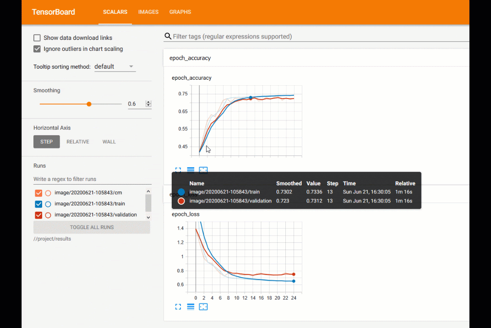
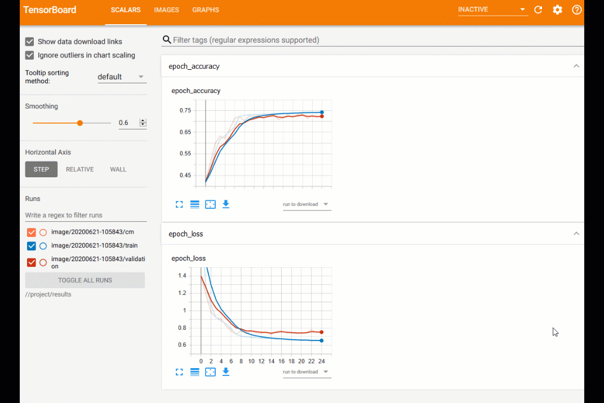

# Experiment Tracking with TensorBoard

### Introduction

[TensorBoard](https://www.tensorflow.org/tensorboard) is a tool that allows you to measure and visualize your machine learning workflow. It's based on the [TensorFlow](https://www.tensorflow.org/) open-source platform for machine learning. TensorFlow lets you easily acquire data, train models, serve predictions, and refine experiment results.   
TensorBoard, in turn, lets you measure, visualize, and share your experiment results. It also provides functionality for creating dataflow graphs that describe how data moves through a graph or series of nodes. All of this is provided through [python](https://www.python.org/), Java, Go, and JavaScript.

Neu.ro includes TensorBoard that lets you train ML models. If you're a beginner, then you can also use TensorBoard via Jupyter Notebooks without installing any additional components. You can run TensorFlow training processes using either CLI or JupyterLab. This guide will take you through a sample ML training task using TensorFlow and viewing the experiment in TensorBoard.

In this example, we will create a training model, deploy the model, and review the results. You must note that the logs of the project are saved on the platform storage. This lets you run or stop TensorBoard whenever required. Whenever you're done with the experiment, you should terminate the job to limit the amount of consumed GPU hours. Our example is based on the [Displaying image data in TensorBoard](https://www.tensorflow.org/tensorboard/image_summaries) guide.

### Creating Training Using CLI

This training lets you log tensors and arbitrary images and view them in TensorBoard. We will use a sample image from the public Fashion MNIST dataset, convert it into an image, and visualize it in TensorBoard.

To create the training:

* Create a new project using the following command:

```text
(base) C:\Projects>neuro project init
project_name [Neuro Project]: imagesummary
project_slug [imagesummary]: image
code_directory [modules]:
```

Once the project is initialized, we will build the code to run our model. The next steps will guide you through creating the `train.py` file that will include the code.

* In the `<project directory>/modules` directory \(`image/modules` in our example\), add the following lines to the `train.py` file:

```text
from datetime import datetime
import io
import itertools
from six.moves import range

import tensorflow as tf
from tensorflow import keras

import matplotlib.pyplot as plt
import numpy as np
import sklearn.metrics
```

* Next, we will download and load our data from the [Fashion-MNIST](https://research.zalando.com/welcome/mission/research-projects/fashion-mnist/) dataset:

```text
# Download the data. The data is already divided into train and test.
# The labels are integers representing classes.
fashion_mnist = keras.datasets.fashion_mnist
(train_images, train_labels), (test_images, test_labels) = fashion_mnist.load_data()
# Names of the integer classes, i.e., 0 -> T-short/top, 1 -> Trouser, etc.
class_names = ['T-shirt/top', 'Trouser', 'Pullover', 'Dress', 'Coat',
               'Sandal', 'Shirt', 'Sneaker', 'Bag', 'Ankle boot']
```

After the dataset is loaded, we will have a list of [matplotlib plots](https://matplotlib.org/). These have to be converted to tensors before you can start visualizing them. 

* To convert [matplotlib plots](https://matplotlib.org/) to images, add the following code:

```text
def plot_to_image(figure):
"""Converts the matplotlib plot specified by 'figure' to a PNG image and
returns it. The supplied figure is closed and inaccessible after this call."""
# Save the plot to a PNG in memory.
buf = io.BytesIO()
plt.savefig(buf, format='png')
# Closing the figure prevents it from being displayed directly #inside the notebook.
plt.close(figure)
buf.seek(0)
# Convert PNG buffer to TF image
image = tf.image.decode_png(buf.getvalue(), channels=4)
# Add the batch dimension
image = tf.expand_dims(image, 0)
return image
```

Next, we will use the data that we have to build an example. We will create an image classifier to classify the [Fashion-MNIST](https://research.zalando.com/welcome/mission/research-projects/fashion-mnist/) dataset that we have converted into tensors.

* To build the classifier, add the following code:

```text
model = keras.models.Sequential([
    keras.layers.Flatten(input_shape=(28, 28)),
    keras.layers.Dense(32, activation='relu'),
    keras.layers.Dense(10, activation='softmax')
])

model.compile(
    optimizer='adam',
    loss='sparse_categorical_crossentropy',
    metrics=['accuracy']
)
```

* We will have to track how the classifier is performing through a confusion matrix. To create a confusion matrix, we will use the [Scikit-learn](https://scikit-learn.org/stable/auto_examples/model_selection/plot_confusion_matrix.html) function and then plot using the matplotlib:

```text
def plot_confusion_matrix(cm, class_names):
    """
    Returns a matplotlib figure containing the plotted confusion matrix.

    Args:
      cm (array, shape = [n, n]): a confusion matrix of integer classes
      class_names (array, shape = [n]): String names of the integer classes
    """
    figure = plt.figure(figsize=(8, 8))
    plt.imshow(cm, interpolation='nearest', cmap=plt.cm.Blues)
    plt.title("Confusion matrix")
    plt.colorbar()
    tick_marks = np.arange(len(class_names))
    plt.xticks(tick_marks, class_names, rotation=45)
    plt.yticks(tick_marks, class_names)

    # Normalize the confusion matrix.
    cm = np.around(cm.astype('float') / cm.sum(axis=1)[:, np.newaxis], decimals=2)

    # Use white text if squares are dark; otherwise black.
    threshold = cm.max() / 2.
    for i, j in itertools.product(range(cm.shape[0]), range(cm.shape[1])):
        color = "white" if cm[i, j] > threshold else "black"
        plt.text(j, i, cm[i, j], horizontalalignment="center", color=color)

    plt.tight_layout()
    plt.ylabel('True label')
    plt.xlabel('Predicted label')
    return figure
```

* Now that we have created the classifier and its confusion matrix, we need to log the basic metrics and the confusion matrix at the end of every cycle. Note that we have selected `results` as the log directory. You can select other directories too, if required.

```text
logdir = "results/image/" + datetime.now().strftime("%Y%m%d-%H%M%S")
# Define the basic TensorBoard callback.
tensorboard_callback = keras.callbacks.TensorBoard(log_dir=logdir)
file_writer_cm = tf.summary.create_file_writer(logdir + '/cm')

def log_confusion_matrix(epoch, logs):
# Use the model to predict the values from the validation dataset.
test_pred_raw = model.predict(test_images)
test_pred = np.argmax(test_pred_raw, axis=1)

# Calculate the confusion matrix.
cm = sklearn.metrics.confusion_matrix(test_labels, test_pred)
# Log the confusion matrix as an image summary.
figure = plot_confusion_matrix(cm, class_names=class_names)
cm_image = plot_to_image(figure)

# Log the confusion matrix as an image summary.
with file_writer_cm.as_default():
tf.summary.image("Confusion Matrix", cm_image, step=epoch)
```

* Finally, let's train the classifier:

```text
# Define the per-epoch callback.
cm_callback = keras.callbacks.LambdaCallback(on_epoch_end=log_confusion_matrix)

# Train the classifier.
model.fit(
      train_images,
train_labels,
epochs=25,
verbose=0,  # Suppress chatty output
callbacks=[tensorboard_callback, cm_callback],
validation_data=(test_images, test_labels),
)
```

Now that you have created the training code, use the following commands to run the classifier:

1. `make setup`. This creates the required framework for the experiment before the job is executed.
2. `make train`. You need to press CTRL+C to detach from the process. This starts the job required for training.
3. `make tensorboard`. This starts a TensorBoard instance that visualizes the experiment.

```text
(base) C:\Projects\image>make tensorboard
neuro run  \
        --name tensorboard-image \
        --preset cpu-small \
        --tag "target:tensorboard" --tag "kind:project" --tag "project:image" --tag "project-id:neuro-project-d2c1fffe" \
        --http 6006 \
        --http-auth \
        --browse \
        --life-span=1d \
        --volume storage:image/results://project/results:ro \
        tensorflow/tensorflow:latest \
        tensorboard --host=0.0.0.0 --logdir=//project/results
Job ID: job-650959b2-3f85-41fc-b423-07d48cf460c2 Status: pending
Name: tensorboard-image
Http URL: https://tensorboard-image--clarytyllc.jobs.neuro-public.org.neu.ro
Shortcuts:
  neuro status tensorboard-image     # check job status
  neuro logs tensorboard-image       # monitor job stdout
  neuro top tensorboard-image        # display real-time job telemetry
  neuro exec tensorboard-image bash  # execute bash shell to the job
  neuro kill tensorboard-image       # kill job
Status: pending Creating
Status: pending Scheduling
Status: pending ContainerCreating
Status: running
Terminal is attached to the remote job, so you receive the job's output.
Use 'Ctrl-C' to detach (it will NOT terminate the job), or restart the
job with `--detach` option.
TensorBoard 2.2.1 at http://0.0.0.0:6006/ (Press CTRL+C to quit)
```

TensorBoard automatically updates every 30 seconds, or you can manually refresh the page to view the latest results. The `results` subfolder of a project is saved on the platform storage. This lets you run and stop TensonBoard as often as you want. 

The TensorBoard interface includes the following tabs:

* Scalars
* Images
* Graphs

#### Scalars 

The **Scalars** dashboard shows how the accuracy and loss change with each epoch. You can use it to track training speed, learning rate, and other metrics. You can move your mouse over the graph to view more details.



You can download the scalar information as a CSV or JSON file. To download, select **Show data download links** and then select the required file format.

#### Images

The **Images** tab displays the confusion matrix for the current training. For our current training \(in which we are classifying images into categories of clothing\), the **Images** tab shows the confusion matrix for various clothing types. 



#### Graphs

The **Graphs** tab visualizes the computation of your model, such as a neural network mode. The Graph visualization lets you easily see what's happening in your model and detect any issues.   


You can double-click on a code unit to open its visualization.

