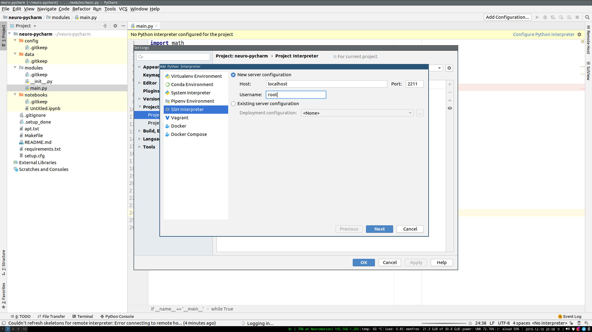

# Remote Debugging with PyCharm Professional

### Introduction

In this tutorial, we show how to set up remote debugging with PyCharm Professional on Neuro Platform using the Neuro project template.

### Initializing a new project

First, ensure that you have the `neuro` client installed and configured:

```bash
pip install -U neuromation
neuro login
```

Then, initialize an empty project:

```bash
neuro project init
```

This command asks several questions about your project:

```text
project_name [Name of the project]: Neuro PyCharm
project_slug [neuro-pycharm]: 
code_directory [modules]:
```

Next, configure the project's environment on Neuro Platform:

```bash
neuro-flow build myimage
```

### Setting up PyCharm

Open the project created on the previous step in Pycharm Professional and add sample code to debug \(in this example, we use code snipped taken from [JetBrains documentation](https://www.jetbrains.com/help/pycharm/remote-debugging-with-product.html)\).

Then, _exclude all directories that don't contain Python code_ \(in an empty Neuro project, only `modules/` is supposed to contain code\). PyCharm does not synchronize excluded directories. For that, select all directories to exclude, mouse right-click, "Mark Directory as" -&gt; "Excluded". As a result, you will see a configured project:


Run this command to upload your code to the Neuro Platform storage:

```bash
neuro-flow upload ALL
```

Now, we are ready to start a development GPU-powered job on Neuro Platform. In the shell, run:

```bash
neuro-flow run remote_debug
```

This command starts a `remote_debug` job on Neuro Platform, which uses `gpu-small` preset and forwards local post 2211 to the job's SSH port. All running jobs consume your quota, so please _don't forget to terminate your jobs_ when they are no longer needed \(for that, you can run `neuro-flow kill ALL`\).

Then go back to PyCharm project, go to "File" -&gt; "Settings", "Project" -&gt; "Project interpreter" \(you can use search by the word "interpreter"\). Press on the gear sign to see project interpreter options, select "Add...". In the new window, select "SSH Interpreter", and set up the following configuration:

```bash
Host: localhost
Port: 2211
Username: root
```



Press the Next button.

In the new window, specify paths:

```bash
Interpreter: /opt/conda/bin/python
Sync folders: <Project root> -> /neuro-pycharm
```

Note, within the job, your project root is available at the root of the filesystem: `/{project_name}`

Press the Finish button, and your configuration is ready:


Press the OK button.

Once you applied remote interpreter configuration, PyCharm starts files synchronization.

Congratulations! Your PyCharm project is now configured to work with remote Python interpreter running on Neuro job:


Note: if your project mapping was not configured and the remote interpreter attempts to execute a file with a local path on the remote environment, you might need to specify mapping again: "Run" -&gt; "Edit Configurations..." -&gt; "Path mappings":


