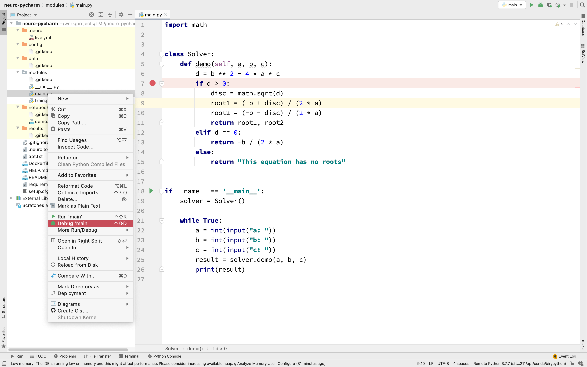
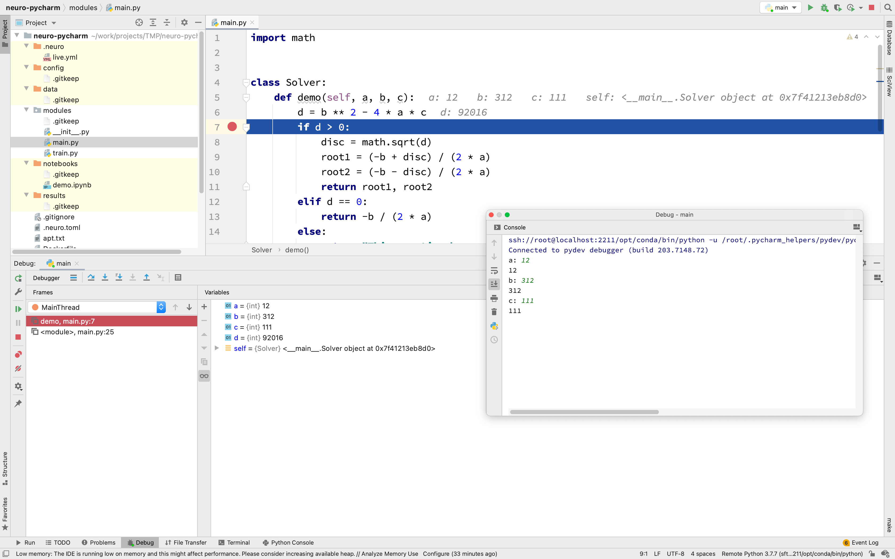

# Remote Debugging with PyCharm Professional

## Introduction

In this tutorial, you can learn how to set up remote debugging with PyCharm Professional on the Neuro Platform using the Neu.ro project template.

## Initializing a new project

First, make sure that you have the Neu.ro CLI client installed and configured:

```bash
> pip install -U neuro-cli neuro-flow
> neuro login
```

Then, initialize an empty project:

```bash
> neuro project init
```

This command will prompt you to enter some info about your project:

```text
project_name [Name of the project]: Neuro PyCharm
project_slug [neuro-pycharm]: 
code_directory [modules]:
```

Next, switch to the new project's folder and configure the project's environment on the Neuro Platform:

```bash
> cd neuro-pycharm 
> neuro-flow build myimage
```

## Setting up PyCharm

Open the project you have just created in PyCharm Professional and add the code you want to debug as a new `main.py` file \(in this example, we use a code snippet from the [JetBrains documentation](https://www.jetbrains.com/help/pycharm/remote-debugging-with-product.html)\).

Then, you will need to exclude all directories that don't contain Python code \(in an empty Neu.ro project, only the `modules` folder will contain code\). PyCharm doesn't synchronize excluded directories. Select all directories to exclude, right-click, and select **Mark Directory as** -&gt; **Excluded**. As a result, you will see a configured project:


Run these commands to upload your code to the Neuro Platform storage:

```bash
> neuro-flow mkvolumes
> neuro-flow upload ALL
```

Now, we are ready to start a GPU-powered development job on the Neuro Platform. Run the following command:

```bash
> neuro-flow run remote_debug
```


This command starts a `remote_debug` job on the Neuro Platform. This job uses the cluster's default preset and forwards the local port 2211 to the job's SSH port. All running jobs consume your quota, so please _don't forget to terminate your jobs_ when they are no longer needed. You can use `neuro-flow kill remote_debug` to kill the job you created in the previous step or `neuro-flow kill ALL` to kill all your running jobs.

Then go back to the PyCharm project and navigate to **Preferences** -&gt; **Project** -&gt; **Project interpreter** \(you can also search for "interpreter"\). Click the **gear icon** to view the project interpreter options and select **Add...** In the new window, select **SSH Interpreter** and set up the following configuration:

* Host: _localhost_
* Port: _2211_
* Username: _root_


When this is done, click **Next**.

In the new window, specify the paths for the interpreter and synced folders:

```bash
Interpreter: /opt/conda/bin/python
Sync folders: <Project root> -> /neuro-pycharm
```

Note that, within the job, your project's root folder is available at the root of the filesystem: `/{project_name}` . 

Click **Finish,** and your configuration is ready:


Click **OK**.

Once you apply the remote interpreter configuration, PyCharm will start file synchronization.

Your PyCharm project is now configured to work with a remote Python interpreter running in a Neu.ro job. 

## Debugging

In this example, we're working with the `main.py` file. To enter debug mode, right-click the file and click **Debug 'main'**:



Now, you can interact with the file in debug mode:




If your project's mapping was not configured and the remote interpreter attempts to execute a file with a local path on the remote environment, you might need to specify the path mappings. You can do that at **Run** -&gt; **Edit Configurations...** -&gt; **Path mappings**:



