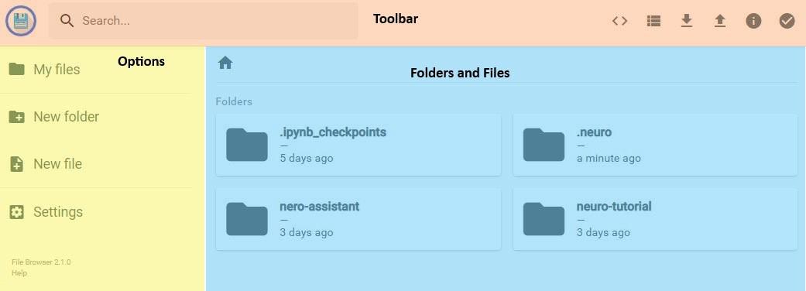
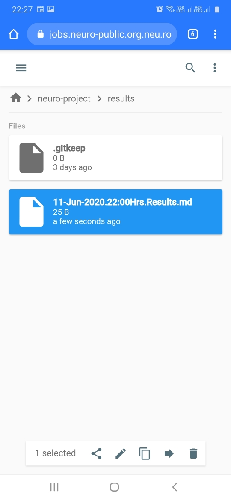
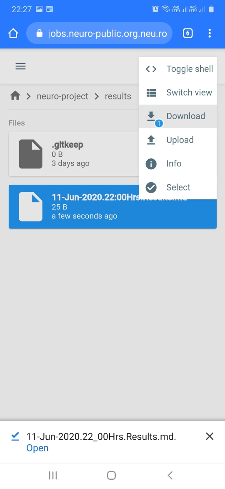

# FileBrowser

## Introduction

FileBrowser is an intuitive web interface used to manage files and folders. The FileBrowser is based on the popular file browsing interface available on [git](https://github.com/filebrowser/filebrowser). FileBrowser lets you:

* [Create files and folders](filebrowser.md#creating-files-and-folders)
* [Download files and folders](filebrowser.md#downloading-files-and-folders)

To start the FileBrowser, click on the **Start FileBrowser** button on the `Neu.ro` homepage.

FileBrowser instances are jobs that run using the cpu-small preset, and are listed in the Jobs window of `Neu.ro` as a job with the tag `kind:web-widget target:filebrowser`. The platform storage is mounted at /var/storage which is also the root directory to let all files persist.

The FileBrowser UI has the following areas:

* **Toolbar:** Displays the list of actions you can perform. The toolbar shows additional options when you select a file or folder, such as copy, rename, share, move, delete.
* **Options:** Displays additional options you have, such as My Files \(home\) link, New Folder, New File, and Settings.
* **Folders and Files:** Displays the contents of the current folder.

Optionally, you can also use Shell from within FileBrowser by click on the toggle shell  button, and run shell commands in the shell area.

After you are done working with FileBrowser, ensure that you kill the job associated with it.

FileBrowser runs as a job with the cpu-small preset. All FileBrowser jobs are automatically killed after 24 hours.

## Creating Files and Folders

You can create files and folders from the FileBrowser. While creating files, FileBrowser has a basic text editor that lets you add content to the file. However, it is recommended that you upload instead of creating them.

**To create a folder:**

1. From the Options area of the FileBrowser, click on the **New Folder** button. 
2. Enter a name for the new folder. 

**To create a file:**

1. From the Options area of the FileBrowser, click on the **New File** button. 
2. Enter a name for the file.  The file is created and you are taken to the file editor where you can enter the contents of the file.
3. Click **Save** after entering the content of the files. 

**To upload files:**

1. From the Toolbar, click on the **upload** button. 
2. Select the file that you want to upload. The file is uploaded. You can edit a file by clicking on the **Edit** button. 

## Downloading Files and Folders

You can download files, folders, or the entire storage on FileBrowser using the download button.

**To download files and folders:**

1. Browse to the folder or the file directory and click on the **Download** button.  If you do not select any file, then the current folder is downloaded, else the selected files are downloaded.
2. If you are downloading a folder, then select the format in which you want to download the folder. 

The current folder will be downloaded in the selected format.

## Managing Files and Folders from Mobile Devices

Neu.ro provides seamless support to mobile devices. You can access neu.ro and the FileBrowser from any mobile device to view, upload, download, and manage files on your mobile device. For example, you may want to upload sample images for the [**Object Detection**](https://docs.neu.ro/cookbook/object-detection) ML recipe from your mobile device.

**To download files to your mobile device:**

1. Login into `neu.ro`, and start a FileBrowser.

 

1. Navigate to the folder to download files from, and select the file or folder that you want to download.

 

1. Select Download from the options menu.

 

The file is downloaded to your mobile device.

**To upload files from your mobile device:**

1. Login into neu.ro, and start a FileBrowser.

 

1. Navigate to the folder you want to upload files to from your mobile, and select Upload from the Options menu.

 

1. Navigate to the folder from where you want to upload the file and select the file.

The file is uploaded to your mobile device.

