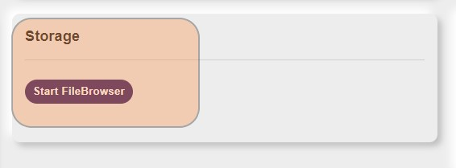
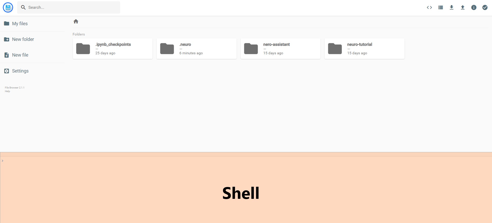
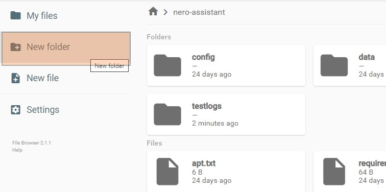
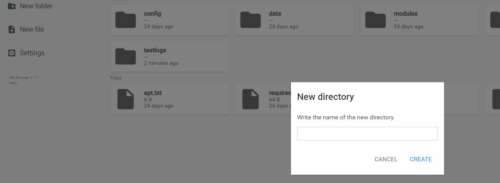
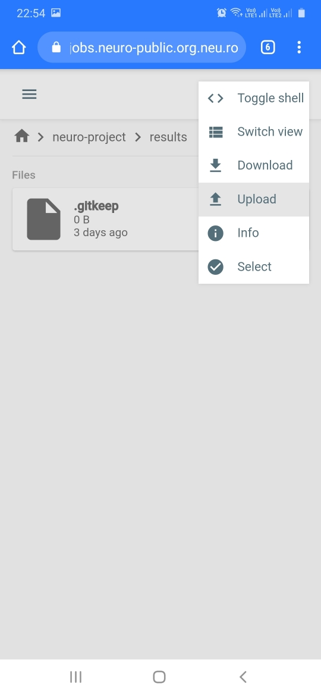

# FileBrowser

## Введение

FileBrowser - это интуитивно понятный веб-интерфейс, используемый для управления файлами и папками. FileBrowser основан на популярной программе просмотра файлов, доступной на [git](https://github.com/filebrowser/filebrowser). При помощи FileBrowser можно:

* [Создавать файлы и папки](filebrowser.md#creating-files-and-folders)
* [Загружать файлы и папки](filebrowser.md#downloading-files-and-folders)

Чтобы запустить FileBrowser, нажмите кнопку **Start FileBrowser** на главной странице `Neu.ro`.

Экземпляры FileBrowser это задания, которые выполняются с использованием пресет cpu-small и перечислены в окне «Jobs» `Neu.ro`, как задания с тегом `kind:web-widget target:filebrowser`. Файловая система платформы смонтирована в директории /var/storage, которая также является каталогом root, в котором сохраняются все файлы.

Пользовательский интерфейс FileBrowser имеет следующие области:

* **Toolbar:** Отображает список действий, которые вы можете выполнить. Toolbar имеет дополнительные опции при выборе файла или папки, такие как копирование, переименование, предоставить доступ, перемещение, удаление.
* **Options:** Отображает дополнительные опции, такие как My Files \(домашняя станица\), New Folder, New File и Settings.
* **Folders and Files:** Отображает содержимое текущей папки.

Нажав на кнопку переключения на командную оболочку , Вы так же можете использовать Shell из FileBrowser и запускать команды из командной строки.

После того, как Вы закончите работу с FileBrowser, убедитесь, что Вы закрыли задания, связанные с ним.

FileBrowser работает как задание с пресет cpu-small. Все задания FileBrowser автоматически уничтожаются через 24 часа.

## Создание файлов и папок

Вы можете создавать файлы и папки из FileBrowser. При создании файлов FileBrowser предоставляет текстовый редактор, посредством которого можно добавить содержимое в файл. Тем не менее, рекомендуется загружать файлы, а не создавать их.

**Для создания папки:**

1. В области Option в FileBrowser нажмите на кнопку **New Folder**. 
2. Введите наименование новой папки. 

**Для создания файла:**

1. В области Option в FileBrowser нажмите на кнопку **New File**. 
2. Введите наименование нового файла.  

   Будет создан новый файл и Вы попадете в редактор, в котором Вы можете ввести содержимое файла.

3. После ввода содержимого нажмите **Save**. 

**Для загрузки файла:**

1. На панели инструментов нажмите кнопку **upload** . 
2. Выберите файл, который Вы хотите загрузить. Файл будет загружен. Можно отредактировать файл, нажав на кнопку **Edit**. 

## Загрузка файлов и папок

Через FileBrowser, используя кнопку Download, возможно загрузить файлы, папки или всю файловую систему.

**Для загрузки файлов и папок:**

1. Перейдите в папку или каталог с файлами и нажмите кнопкуe **Download**.  Выберете какой-либо файл для загрузки, если файл не будет выбран, то будет загружена вся текущая папка.
2. Если Вы загружаете папку, то выберите формат, в котором будет загружена папка. 

Текущая папка будет загружена в выбранном формате.

## Управление файлами и папками с мобильных устройств

Neu.ro обеспечивает полную поддержку мобильных устройств. Вы можете получить доступ к neu.ro и FileBrowser с любого мобильного устройства для просмотра, загрузки, выгрузки и управления файлами. Например, вы можете загрузить образцы изображений для рецепта [**Object Detection**](https://docs.neu.ro/cookbook/object-detection) ML с Вашего мобильного устройства.

**Для загрузки файлов на Ваше мобильное устройство:**

1. Войдите в `neu.ro` и запустите FileBrowser.

 

1. Перейдите в какую-либо папку и выберите файл или папку, которую вы хотите загрузить.

 

1. Выберите Download из меню параметров.

 

Файл будет загружен на Ваше мобильное устройство.

**Для загрузки файлов из Вашего мобильного устройства:**

1. Войдите в `neu.ro` и запустите FileBrowser.

 

1. Перейдите в папку, в которую Вы хотите загрузить файлы со своего мобильного устройства, и выберите Upload из меню Options.

 

1. Перейдите в папку, откуда Вы хотите загрузить файл и выберите файл.

Файл будет загружен с Вашего мобильного устройства.

