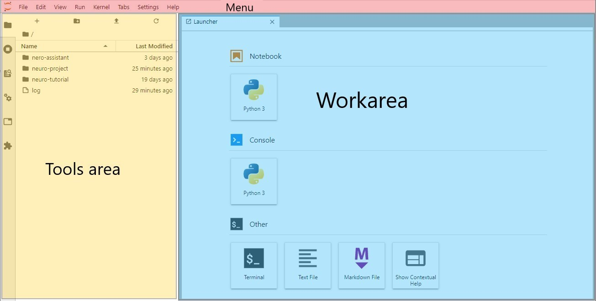
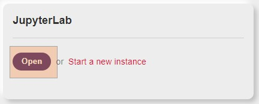

# JupyterLab

Jupyter Notebooks is a powerful computational notebook tool that lets you create and share your code. JupyterLab uses Jupyter Notebook and takes it much further. JupyterLab is an interactive web-based development environment for working with Jupyter Notebooks, text editors, terminals, and custom components.

You can arrange multiple Notebooks, documents, and activities in a single interface using tabs and splitters. Also, JupyterLab has a modular extensible architecture that lets you customize your development environment. A Notebook is just one of the components that you can work on in the JupyterLab.

You can start a new instance of the JupyterLab by clicking on Start in the JupyterLab area.

When you start a JupyterLab, the platform storage is attached as /var/storage. All data created during a lab session in this folder persists and can be used later. The instance is not killed when you close the tab. You can always open the instance from the Neu.ro dashboard. However, the instance is terminated automatically after 24 hours of initiation.

All JupyterLab instances are jobs that run on GPU-small preset. You must kill the JupyterLab session whenever you are done; else, it consumes GPU hours. All JupyterLab sessions are automatically killed after 24 hours.

The Jupyter UI has the following areas:

* Tools area: The tools area lists the most commonly used commands.
* Work area: The work area hosts the launcher and the tabs that you are currently working on.
* Menu: The menu bar includes all available options for the JupyterLabs.

The tools area lists a host of options available for JupyterLabs, such as:

* File Browser for managing files in the storage.
* Sessions for managing a list of active sessions.
* Commands for viewing the commands available for the current state.
* Properties for managing the properties for the current selection.
* Tabs to view the list of tabs open.
* Extension Manager to enable and manage customizations.

For more information about JuputerLab, see [JupyterLab](https://jupyterlab.readthedocs.io/en/stable/) documentation.

## Manage your JupyterLab Instances

You can manage your JupyterLab instances from the Neu.ro dashboard. The JupyterLab instances are listed in the Running Jobs section, and their URLs start with [http://jupyter-lab-](http://jupyter-lab-). You can click on the URL to open the instance.

You can view the details of your JupyterLab instance by clicking on the job ID.

You can open an instance by:

* Clicking the Open button from the Jupyter Notebooks section.

* Clicking on the URL for the instance.

The instance is listed as a job in your Neu.ro dashboard. You can kill an instance from the Running Jobs section of your dashboard. Note that closing the tab does not kill the instance.

Alternatively, you can kill the instance from the JupyterLab instance using the File &gt; Shut Down option.

An instance is automatically terminated 24 hours after initiation.

