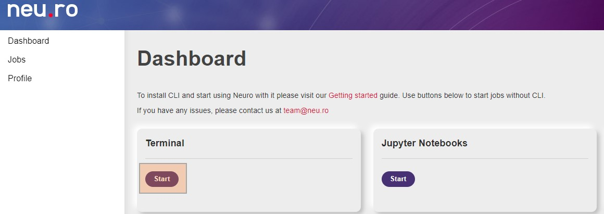
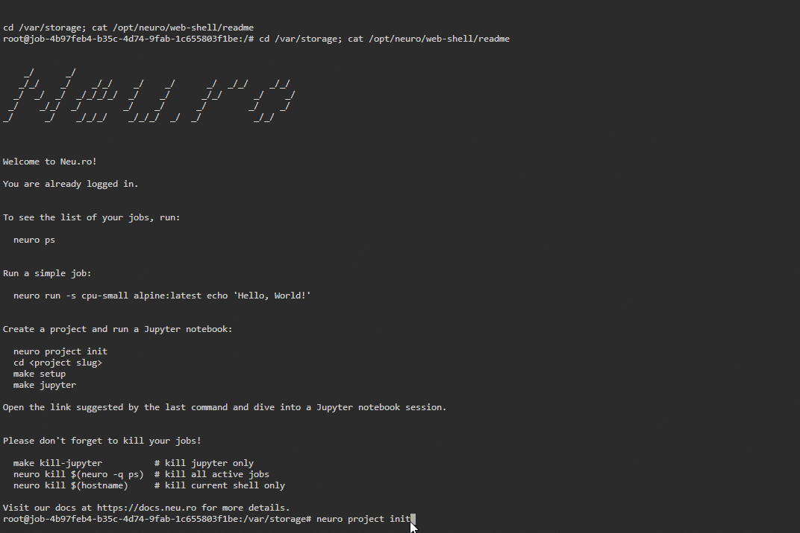

# Terminal

## Introduction

Terminals let you work with Neu.ro without setting up the local environment. Terminals are jobs and active terminals are listed on the Neu.ro dashboard.



You can start a new terminal by clicking the Start button in the Terminal area. You can use the terminal to manage jobs and your docker environments. You should kill the terminal session whenever you are done. All terminal sessions are automatically killed after 24 hours.

When you start a terminal, the platform storage is attached as /var/storage. Your terminal session starts in that folder. All data created during a terminal session persists and can be used later. Also, terminal sessions do not provide version control unless you use basic authorization \(through username and password\), or out your access token on storage.

## Download data from a terminal

You do not have access to the local machine file system from a terminal session. Also, you cannot download data from the terminal to your local machine. However, you can upload data to your storage from any external resource using a terminal. See [Storage](https://github.com/neuromation/platform-docs/tree/8c2237b1dbb6b440fcdeb85fbe5156280f490138/web/link%20to%20Storage%20docs/README.md) for details.

## Connect to a running job

You can connect to a running job from the terminal and execute a command by using the neuro job exec command.

**Sample command:**

1. **Running a simple list command in the container hosting the job**

```text
root@job-a8cd05fe-57bd-4359-a388-e6ee1f92a269:/var/storage/neuro-tutorial/SampleCode/VoiceExperiment# neuro job exec job363 ls
The authenticity of host 'ssh-auth.neuro-public.org.neu.ro (34.194.131.79)' can`t be established.
ECDSA key fingerprint is SHA256:p0rIvIDzdWvwqNtslE2agZDai7NFYz5VdrKrZI+7O2Y.Are you sure you want to continue connecting (yes/no)?yes
bin dev home lib32 libx32 mnt proc run srv tmp varboot etc lib lib64 media opt root sbin sys usr
Connection to ssh-auth.neuro-public.org.neu.ro closed.
```

1. **Providing a bash terminal to the container hosting the job**

```text
root@job-a8cd05fe-57bd-4359-a388-e6ee1f92a269:/var/storage/neuro-tutorial/SampleCode/VoiceExperiment# neuro job exec job363 /bin/bashroot@job-36d59977-84d2-40e5-9475-e4af25a06b6c:/# echo 'Hello, World!'
Hello, World!
root@job-36d59977-84d2-40e5-9475-e4af25a06b6c:/# exit
exit
Connection to ssh-auth.neuro-public.org.neu.ro closed.
```

The terminal lets you work on the container while the job is running.

## Create a new project

You can create a new project from the web terminal. You use the neuro project init command to initialize a new project. You can use the platform storage available in /var/storage for the project.

For example, you can train your first machine learning model on the Neu.ro platform from the terminal session. When you initialize a project, you are prompted to answer some simple questions in order to customize your project. Your project is created based on your responses. The files of the project are saved in your storage unless you change a working directory from /var/storage.

In this below example, we will create a sample project.



